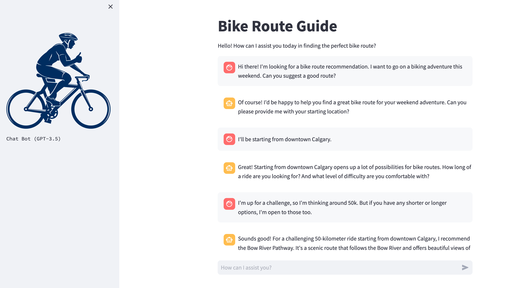

# Bike Route Guide- chatbot
Welcome to the Bike Route Guide GitHub repository! This repository contains code for a Streamlit application that acts as an AI-powered biking companion. The application assists cyclists in finding the best bike routes and paths, offering extensive knowledge of biking trails, road safety, and urban cycling. Cyclists can rely on this AI companion to discover exciting and safe biking adventures.



# Getting Started

To use this application, you need to set up your environment and provide your OpenAI API key. And, please ensure you have: 
- anaconda / miniconda in your machine. If not, please check the [installation documentation](https://docs.anaconda.com/free/anaconda/install/index.html)

Now follow the instruction bellow:

# Create a .env File

Inside the **app** directory of the cloned repository, create a **.env** file. This file will store your OpenAI API key securely. include the following line in your .env file to specify your OpenAI API key:

```
OPENAI_API_KEY='your-openai-key-here'
```
Replace 'your-openai-key-here' with your actual [OpenAI API key](https://platform.openai.com/api-keys).

## Setting up Environment
Open a terminal and navigate to the root directory of your repository, then run the following command:

```
conda create --name <env-name> python=3.11
```
replace `<env-name>` with the name of your conda environment.


## Activate the Conda Environment
After creating the environment, you can activate it using the following command:

```
conda activate <env-name>
```
## Install Dependencies

```
pip install -r requirements.txt
```

## Run the Application
You can now run the Bike Route Guide application. Navigate to the root directory of the repository and execute the following command:

```
streamlit run app/app.py --server.address="0.0.0.0"
```
## How to Use
Once the application is running, you can interact with it through a web interface. The AI biking companion will guide you through finding the perfect bike route. Follow the prompts and enter your preferences to receive recommendations.
